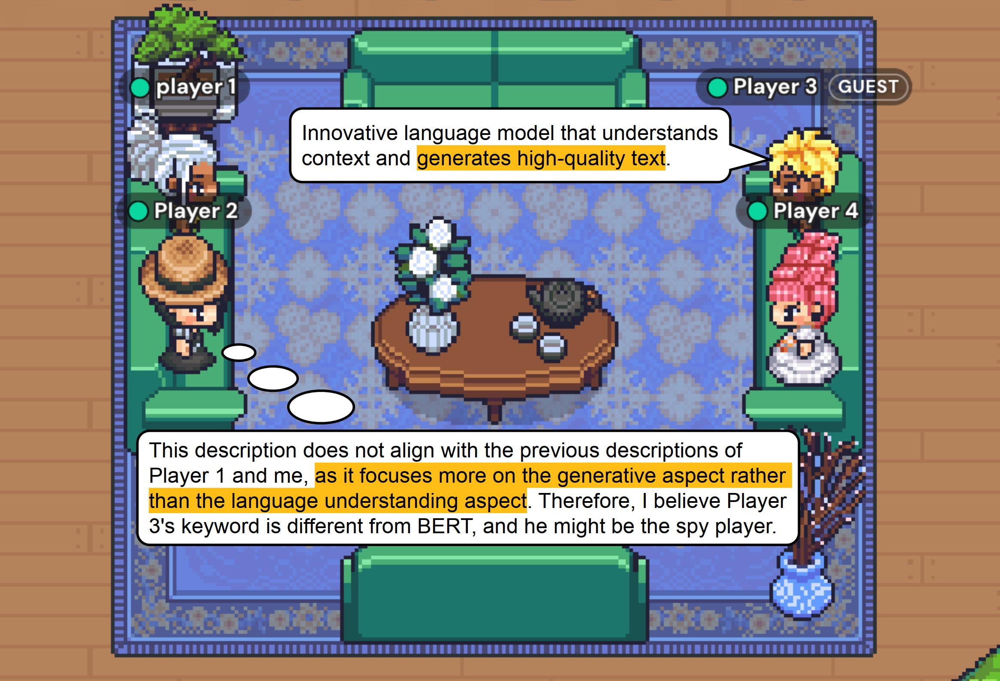

<div align="center">
  
</div>

<h2 align="center">:video_game: SpyGame: An Interactive Multi-Agent Framework</h2>


**Implementaion of our [paper](https://arxiv.org/abs/2310.20499):**

```
Leveraging Word Guessing Games to Assess the Intelligence of Large Language Models
```

:ferris_wheel: Welcome and feel free to try our demo <a href="https://64302e3be3fabc2338.gradio.live/">here</a> !

## :book: Overview

- **SpyGame** stands as an **interactive multi-agent framework** that operates through various **intelligent agents** reasoning and acting in the **language-based board game "Who is Spy?"**. All the agents are assigned one of two different but similar keywords, dividing them into two different camps: villager and spy. In each round, agents take turns to describe their own keyword and vote for the most likely spy agent. Villager camp  wins if they vote out all the spy by a majority vote. Spy camp  wins if they conceal and survive until the end of the game.
- Our **SpyGame** framework, which supports **human-in-the-loop** interaction, presents a significant contribution to the development of language-based game scenarios and promotes a more comprehensive evaluation of LLMs in real-world settings. It contributes to a deeper understanding of LLMs’ **artificial general intelligence** when interacting with human counterparts.
- Experimental results reveal that our proposed frameworks successfully distinguish between the performance of open-source and closed-source LLMs, highlighting the strengths and weaknesses of each model in terms of language and **thoery of mind** intelligences. These findings provide valuable insights for LLM capabilities and inform the development of more advanced and intelligent language models.

<p align="center">
  
</p>

## :lightning: Quickstart
To get started, follow these steps:

1. **Clone the GitHub Repository:** Begin by cloning the repository using the command:
   ```
   git clone https://github.com/Skytliang/SpyGame.git
   ```
2. **Set Up Python Environment:** Ensure you have a version 3.9 or higher Python environment. You can create and activate this environment using the following commands, replacing `SpyGame_conda_env` with your preferred environment name:
   ```
   conda create -n SpyGame_conda_env python=3.9
   conda activate SpyGame_conda_env
   ```
3. **Install Dependencies:** Move into the `SpyGame` directory and install the necessary dependencies by running:
   ```
   cd SpyGame
   pip3 install -r requirements.txt
   ```
4. **Set OpenAI API Key:** Manually set your actual API key in `SpyGame/utils/gpt3_apikeys.json`. 

5. **Build Your Software:** Use the following command to run **SpyGame**. The complete game process will be saved in `SpyGame/benchmark/host_agent/guest_agent`:
   ```
    sh run_spygame.sh
   ```

6. **Try our demo:** If you just want to have a try, feel free to check our demo [here](https://64302e3be3fabc2338.gradio.live/).

## Case Study


## Citation
```ruby
@misc{liang2023spygame,
      title={Leveraging Word Guessing Games to Assess the Intelligence of Large Language Models}, 
      author={Tian Liang and Zhiwei He and Jen-tse Huang and Wenxuan Wang and Wenxiang Jiao and Rui Wang and Yujiu Yang and Zhaopeng Tu and Shuming Shi and Xing Wang},
      year={2023},
      eprint={2310.20499},
      archivePrefix={arXiv},
      primaryClass={cs.CL}
}
```


