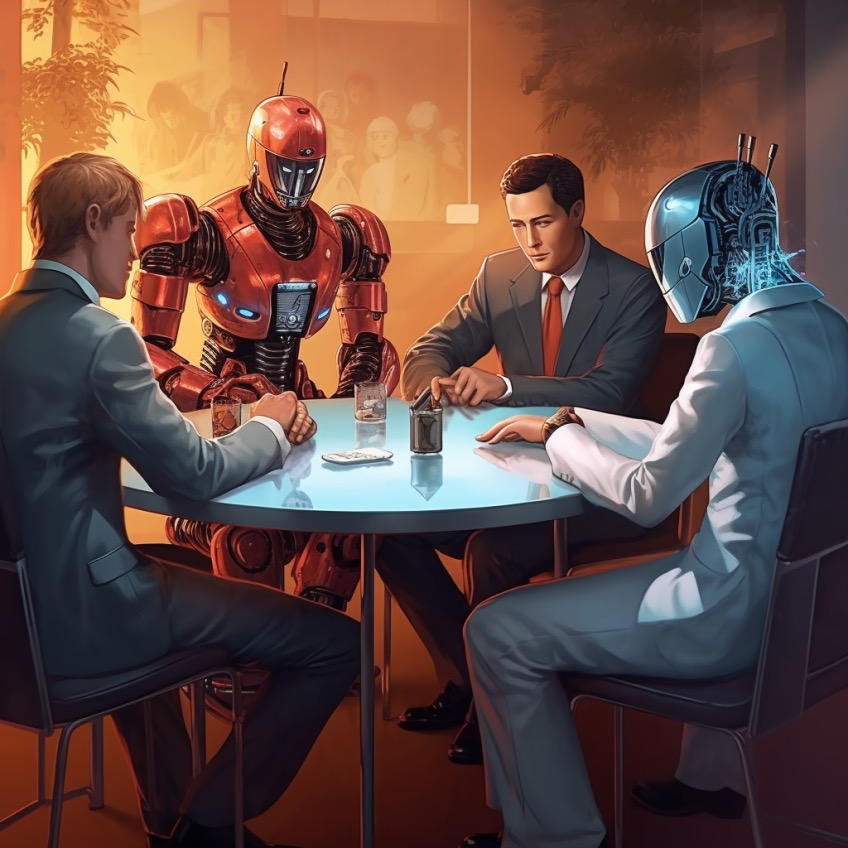

<div align="center">
  
</div>

<h2 align="center">:video_game: SpyGame: An Interactive Multi-Agent Framework</h2>


**Implementaion of our [paper](https://arxiv.org/abs/2310.20499):**

```
Leveraging Word Guessing Games to Assess the Intelligence of Large Language Models
```

:ferris_wheel: Welcome and feel free to try our demo <a href="https://64302e3be3fabc2338.gradio.live/">here</a> !

## :book: Overview

- **SpyGame** stands as an **interactive multi-agent framework** that operates through various **intelligent agents** reasoning and acting in the **language-based board game "Who is Spy?"**. All the agents are assigned one of two different but similar keywords, dividing them into two different camps: villager and spy. In each round, agents take turns to describe their own keyword and vote for the most likely spy agent. Villager camp  wins if they vote out all the spy by a majority vote. Spy camp  wins if they conceal and survive until the end of the game.
- Our **SpyGame** framework, which supports **human-in-the-loop** interaction, presents a significant contribution to the development of language-based game scenarios and promotes a more comprehensive evaluation of LLMs in real-world settings. It contributes to a deeper understanding of LLMs’ **artificial general intelligence** when interacting with human counterparts.
- Experimental results reveal that our proposed frameworks successfully distinguish between the performance of open-source and closed-source LLMs, highlighting the strengths and weaknesses of each model in terms of language and **thoery of mind** intelligences. These findings provide valuable insights for LLM capabilities and inform the development of more advanced and intelligent language models.

<p align="center">
  
</p>

## :zap: Quickstart
To get started, follow these steps:

1. **Clone the GitHub Repository:** Begin by cloning the repository using the command:
   ```
   git clone https://github.com/Skytliang/SpyGame.git
   ```
2. **Set Up Python Environment:** Ensure you have a version 3.9 or higher Python environment. You can create and activate this environment using the following commands, replacing `SpyGame_conda_env` with your preferred environment name:
   ```
   conda create -n SpyGame_conda_env python=3.9
   conda activate SpyGame_conda_env
   ```
3. **Install Dependencies:** Move into the `SpyGame` directory and install the necessary dependencies by running:
   ```
   cd SpyGame
   pip3 install -r requirements.txt
   ```
4. **Set OpenAI API Key:** Manually set your actual API key in `SpyGame/utils/gpt3_apikeys.json`. 

5. **Build Your Benchmark:** Use the following command to run **SpyGame**. The complete game process will be saved in `SpyGame/benchmark/host_agent/guest_agent`:
   ```
    sh run_spygame.sh
   ```

6. **Try our demo:** If you just want to have a try, feel free to check our demo [here](https://64302e3be3fabc2338.gradio.live/).

## Case Study
Note: For the sake of fairness, we randomly shuffle the speaking order of all agents. Please refer to our paper for more details.

In this case, Player 1 , Player 2  and Player 4  are villager players  with the same word **"BERT"**. Player 3  is the spy player  with the keyword **"GPT"**. Here, all the four agents are consistently designated as GPT-4 LLMs.

#### Speaking phase in the first round
* Host : It is now the description phase, please take turns to describe the keyword you received in the order of ['Player 2', 'Player 1', 'Player 3', 'Player 4'].

*  (, **BERT**): It's a revolutionary tool in the field of natural language processing.

*  (, **BERT**): It's a significant breakthrough in understanding contextual nuances in language.

*  (, **GPT**): It's a sophisticated system that can mimic human conversation effectively.

*  (, **BERT**): It's an advanced method that revolutionized machine learning language models.

#### Voting phase in the first round
* Host : It is now the voting phase, Please judge the keywords and identities of these alive players ['Player 1', 'Player 2', 'Player 3', 'Player 4']. And then vote for the player you think is most likely to be a spy agent.

*  (, **BERT**) votes for  (, **BERT**). Reason: Based on the descriptions, I believe that Player 2, Player 3, and I are likely villagers because our descriptions all relate to a tool or system used in language processing and machine learning. However, **Player 4's description seems slightly different, focusing more on the method rather than the tool itself.** Therefore, I suspect that Player 4 might be the spy. I vote for Player 4.

*  (, **BERT**) votes for  (, **GPT**). Reason: Based on the descriptions, I believe that Player 1, Player 2, and I share the same keyword, which is related to a breakthrough in language processing. However, **Player 3's description seems slightly different, focusing more on mimicking human conversation rather than understanding language.** Therefore, I suspect that Player 3 might be the spy. I vote for Player 3.

*  (, **GPT**) votes for  (, **BERT**). Reason: Based on the descriptions, it seems like we all have a similar understanding of our keyword. We're all talking about an advanced technology related to language processing and machine learning. Therefore, I believe that our keyword is GPT. **As for the spy, it's hard to say at this point since everyone's description aligns well with the keyword.** However, if I have to choose, **I would say Player 4 might be the spy because their description was slightly more specific than the rest of us.** I vote for Player 4.

*  (, **BERT**) votes for  (, **BERT**). Reason: Based on the descriptions, it seems like we're all talking about something related to language processing and machine learning. I believe Player 1, Player 3, and myself are villagers since our descriptions align closely with my keyword, BERT. However, **Player 4's description seems a bit different, mentioning an 'advanced method' rather than a tool or system.** Therefore, I suspect Player 4 might be the spy. I vote for Player 4.

* Host: Player 4 has been voted out, but he/she is not the spy player. Let's continue the game.

#### Speaking phase in the second round
* Host : It is now the description phase, please take turns to describe the keyword you received in the order of ['Player 2', 'Player 1', 'Player 3'].

*  (, **BERT**): It's a transformative approach to understanding written language by machines.

*  (, **BERT**): It's a model that has transformed the way machines interpret text.

*  (, **GPT**): It's an AI model that excels in creating coherent text.

#### Voting phase in the second round
* Host : It is now the voting phase, Please judge the keywords and identities of these alive players ['Player 1', 'Player 2', 'Player 3']. And then vote for the player you think is most likely to be a spy agent.

*  (, **BERT**) votes for  (, **GPT**). Reason: Based on the descriptions, I believe that Player 2 and I share the same keyword, as our descriptions both refer to a transformative model in language processing. However, **Player 3's description seems slightly different, focusing more on the creation of coherent text rather than understanding it.** Therefore, I suspect that Player 3 might be the spy. I vote for Player 3.

*  (, **GPT**) votes for  (, **BERT**). Reason: Based on the descriptions, it seems like we all have a similar understanding of our keyword. We're all talking about an advanced technology related to language processing and machine learning. Therefore, I believe that our keyword is GPT. **As for the spy, it's hard to say at this point since everyone's description aligns well with the keyword.** However, if I have to choose, **I would say Player 1 might be the spy because their description was slightly more generic than the rest of us.** I vote for Player 1.

*  (, **BERT**) votes for  (, **GPT**). Reason: After hearing the descriptions in this round, I still believe that Player 1 and I are villagers. Our descriptions continue to align closely with my keyword, BERT, focusing on language interpretation by machines. However, **Player 3's description seems a bit off. While it does mention an AI model and text creation, it doesn't specifically refer to understanding or interpreting language, which is a key aspect of BERT.** Therefore, I suspect Player 3 might be the spy. I vote for Player 3.

* Host: Player 3 is the spy and has been voted out. The villager players win, game over.

## Citation
```ruby
@misc{liang2023spygame,
      title={Leveraging Word Guessing Games to Assess the Intelligence of Large Language Models}, 
      author={Tian Liang and Zhiwei He and Jen-tse Huang and Wenxuan Wang and Wenxiang Jiao and Rui Wang and Yujiu Yang and Zhaopeng Tu and Shuming Shi and Xing Wang},
      year={2023},
      eprint={2310.20499},
      archivePrefix={arXiv},
      primaryClass={cs.CL}
}
```

